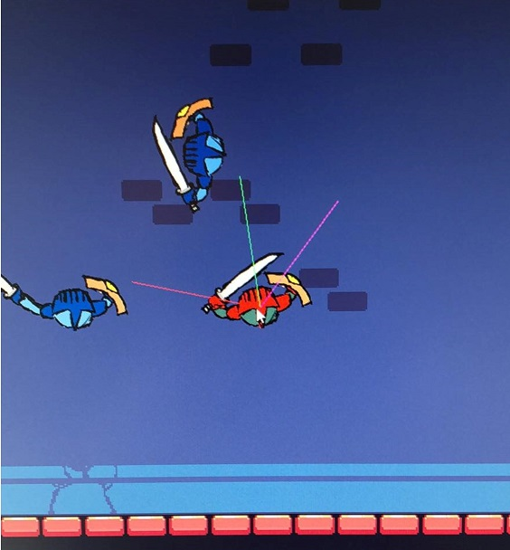

# 2D Multiplayer game
### A fighting game for two people

This project is a two player game that can be played online. 
The server is written in Go and the game-client is written in C# with Unity as the game engine. 

-----------------------------------


<br><br>
# Instructions
To start the server in server-mode:

```go run server.go --mode server```

To start the server in client-mode: 
(This mode is used to simulate a player client)
```go run client.go --mode client```

The game client waits till two clients are connected before the game starts. For the Unity-client to start properly it needs to have the server up and running beforehand and that another client is connecting within a reasonable time.

-----------------------------------
<br><br>
#### Folder Structure: 

## /2DMPGame/
Contains the game client, created with C# and Unity.

## /Server/
Contains the code of the server.

